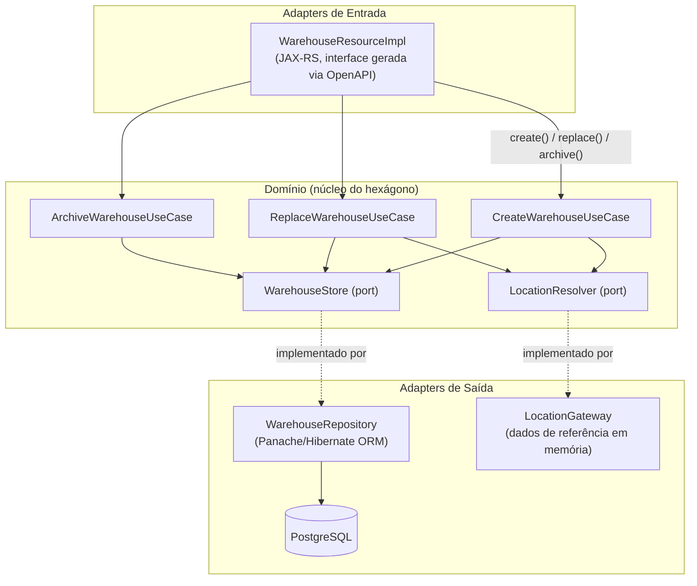
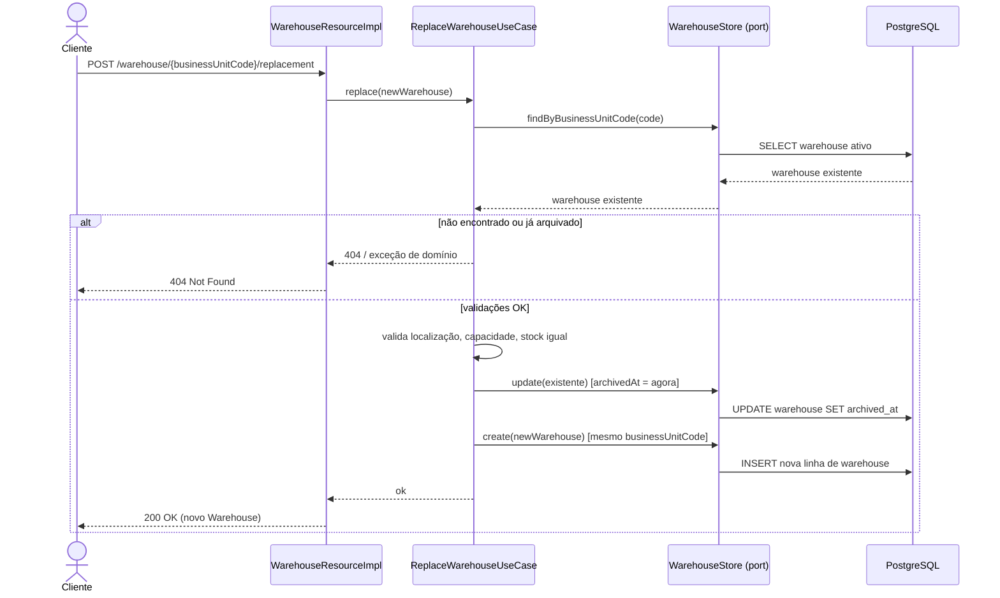

# FnCS Case Study — Desafio de Fulfilment de Warehouse


> Case study de entrevista para uma vaga de backend Quarkus/Java. Este repositório contém o
> **enunciado original** mais **duas implementações independentes** do mesmo desafio, escritas
> sob filosofias de engenharia diferentes, para permitir comparação lado a lado.

## Do que se trata

`fcs-interview-code-assignment-main` é um sistema simplificado de **gestão de colocation de
Warehouses** (armazéns). O domínio tem quatro entidades — `Location`, `Store`, `Warehouse`,
`Product` — e o desafio pede para implementar os endpoints REST e as regras de negócio que
faltam em torno da criação, consulta, substituição ("replace") e arquivamento de warehouses,
além de uma feature bônus de associação de fulfilment.

## Por que existe

O mesmo enunciado foi implementado duas vezes para comparar **duas respostas de engenharia
igualmente válidas, porém diferentes** para o mesmo problema:

- **`java-assignment-architect`** — abordagem purista DDD/hexagonal: exceções de domínio
  explícitas, um `ExceptionMapper` dedicado, eventos CDI para efeitos colaterais transversais.
- **`java-assignment-senior`** — abordagem pragmática de dev sênior: número mínimo de classes,
  uso direto de `WebApplicationException`, sem camadas extras de abstração.

`java-assignment` é o enunciado **original e intocado** entregue aos candidatos (os stubs dos
endpoints ainda lançam `UnsupportedOperationException`) e é mantido como baseline/referência.

> **Nota sobre o estado do repositório**: no momento desta escrita, nem `java-assignment-architect`
> nem `java-assignment-senior` têm stubs remanescentes com `UnsupportedOperationException`, e os
> dois `QUESTIONS.md` estão totalmente respondidos. Este documento reflete esse estado on-disk —
> reconfira se os módulos forem editados novamente depois.

## Sumário

- [Do que se trata](#do-que-se-trata)
- [Por que existe](#por-que-existe)
- [Arquitetura](#arquitetura)
- [Funcionalidades](#funcionalidades)
- [Architect vs. Senior](#architect-vs-senior)
- [Instalação / Setup](#instalação--setup)
- [Uso](#uso)
- [Estrutura do Projeto](#estrutura-do-projeto)
- [Licença](#licença)

## Arquitetura

Os dois módulos concluídos seguem um formato de **ports and adapters (hexagonal)** para o
subdomínio `Warehouse`: um adapter REST recebe as requisições HTTP, delega para um use case na
camada de domínio, e o use case fala com a persistência e com outros bounded contexts
(`Location`, `Store`, `Product`) sempre através de ports (interfaces) — nunca diretamente.



A operação de **replace** é o único fluxo especial do domínio: ela arquiva o warehouse existente
de um Business Unit Code e cria um novo warehouse reaproveitando esse mesmo código, mantendo o
histórico de custo e operação rastreável durante a troca.



## Funcionalidades

| Capacidade | `java-assignment` (original) | `java-assignment-architect` | `java-assignment-senior` |
|---|---|---|---|
| `Location.resolveByIdentifier` | ❌ stub (`UnsupportedOperationException`) | ✅ implementado | ✅ implementado |
| Sync do Store com sistema legado após commit | ❌ stub | ✅ evento CDI, disparado pós-commit | ✅ callback via `TransactionSynchronizationRegistry`, pós-commit |
| Warehouse create/get/list | ❌ stub | ✅ implementado | ✅ implementado |
| Warehouse archive | ❌ stub | ✅ implementado, exceções de domínio | ✅ implementado, `WebApplicationException` |
| Warehouse replace (archive + recriação) | ❌ stub | ✅ implementado, validado | ✅ implementado, validado |
| Validação de Business Unit Code / localização / capacidade / stock | ❌ stub | ✅ `WarehouseValidator` | ✅ inline no use case |
| Bônus: associação de fulfilment (Warehouse↔Product↔Store) | ❌ ausente | ✅ `FulfilmentAssociationResource` (CRUD completo + regras de domínio) | ✅ `FulfilmentResource` (create + list, regras inline) |
| `QUESTIONS.md` respondido | — (template do candidato) | ✅ respondido | ✅ respondido |

## Architect vs. Senior

Os dois módulos resolvem **exatamente o mesmo enunciado** — mesmas entidades, mesmos endpoints,
mesmas regras de negócio — mas escolhem trade-offs diferentes:

| Aspecto | `java-assignment-architect` | `java-assignment-senior` |
|---|---|---|
| Tratamento de erro | Hierarquia própria de domain exceptions (`WarehouseDomainException` e subclasses) + um `WarehouseExceptionMapper` (`@Provider`) dedicado que traduz erros de domínio em HTTP | `WebApplicationException(mensagem, status)` lançada diretamente do use case/resource, sem hierarquia de exceções de domínio |
| Efeitos colaterais transversais (sync do Store legado) | Evento CDI (`StoreLegacySyncEvent`) disparado pelo `StoreResource`, observado por `StoreLegacySyncObserver` | `Runnable` registrado via `TransactionSynchronizationRegistry.registerInterposedSynchronization`, executado diretamente no `StoreResource` |
| Validação | Extraída para um collaborator dedicado, `WarehouseValidator`, injetado nos use cases | Inline, direto dentro de cada método do use case |
| Feature bônus de fulfilment | Fatia hexagonal completa: modelo de domínio `FulfilmentAssociation`, port `CreateFulfilmentAssociationOperation`, port `FulfilmentAssociationStore`, resolvers dedicados para `Product`/`Store`, exceções próprias | Uma única entidade Panache (`Fulfilment`) mais um `@ApplicationScoped` REST resource com as 3 restrições de fulfilment verificadas inline |
| Quantidade de arquivos/classes para o mesmo escopo | Maior — uma classe por responsabilidade (port, use case, exceção, mapper) | Menor — lógica concentrada, menos arquivos para navegar |
| Melhor encaixe quando... | O domínio deve crescer, múltiplos times mexem nele, ou separação estrita entre HTTP e domínio é requisito duro | Time-to-ship e um escopo pequeno e estável importam mais do que extensibilidade de longo prazo |

Ambos são funcionalmente equivalentes do ponto de vista do consumidor da API — a interface
`WarehouseResource` gerada via OpenAPI é implementada nos dois.

## Instalação / Setup

### Requisitos

- JDK 17+ (`JAVA_HOME` apontando para uma instalação JDK 17)
- Maven (ou o wrapper `./mvnw` incluído no repo)
- Um container runtime para o Dev Service de PostgreSQL usado pelos testes (Docker ou Podman)

### Build & testes

As duas variantes completas são agregadas por um
[`pom.xml` parent](fcs-interview-code-assignment-main/pom.xml)
(`com.inventorix:java-code-assignment-parent`), então um único build do reactor valida as duas:

```sh
JAVA_HOME=/caminho/para/jdk-17 mvn -s fcs-interview-code-assignment-main/settings-central.xml \
  -f fcs-interview-code-assignment-main/pom.xml clean test
```

Cada módulo também builda standalone (`java-assignment`, o original intocado, fica de fora do
reactor de propósito). Usando `mvn -f <pom.xml>`, funciona a partir da raiz do repositório:

```sh
JAVA_HOME=/caminho/para/jdk-17 mvn -s fcs-interview-code-assignment-main/settings-central.xml \
  -f fcs-interview-code-assignment-main/java-assignment-architect/pom.xml test
```

```sh
JAVA_HOME=/caminho/para/jdk-17 mvn -s fcs-interview-code-assignment-main/settings-central.xml \
  -f fcs-interview-code-assignment-main/java-assignment-senior/pom.xml test
```

Se o seu container runtime for Podman em vez de Docker, aponte o Quarkus Dev Services
(Testcontainers) para o socket do Podman antes de rodar os testes:

```sh
export DOCKER_HOST=unix://$(podman machine inspect --format '{{.ConnectionInfo.PodmanSocket.Path}}')
```

O `quarkus.datasource` só está configurado para o profile `%prod` no `application.properties` —
os modos dev e test dependem do Quarkus Dev Services para subir automaticamente um container
descartável de PostgreSQL, então nenhum setup manual de banco é necessário para `mvn test`.

### Rodando um módulo em dev mode

O `./mvnw` resolve a config do wrapper (`.mvn/`) em relação ao diretório de trabalho atual — por
isso, entre no módulo primeiro. Rodar a partir da raiz do repositório falha com
`ClassNotFoundException: MavenWrapperMain`:

```sh
cd fcs-interview-code-assignment-main/java-assignment-architect
./mvnw quarkus:dev
```

Live coding habilitado — mudanças de código e de entidades são aplicadas ao dar refresh, e o Dev
Services mantém um container PostgreSQL rodando para você.

### Rodando contra um PostgreSQL iniciado manualmente (prod mode)

Com Podman (opção primária nesta máquina — não há daemon Docker instalado):

```sh
podman run -it --rm --name quarkus_test -e POSTGRES_USER=quarkus_test \
  -e POSTGRES_PASSWORD=quarkus_test -e POSTGRES_DB=quarkus_test -p 15432:5432 postgres:13.3
```

Com Docker, se disponível:

```sh
docker run -it --rm=true --name quarkus_test -e POSTGRES_USER=quarkus_test \
  -e POSTGRES_PASSWORD=quarkus_test -e POSTGRES_DB=quarkus_test -p 15432:5432 postgres:13.3
```

Depois, de dentro do diretório do módulo:

```sh
cd fcs-interview-code-assignment-main/java-assignment-architect
./mvnw package
java -jar ./target/quarkus-app/quarkus-run.jar
```

## Uso

Os endpoints de `Warehouse` são gerados a partir de
`src/main/resources/openapi/warehouse-openapi.yaml` (`quarkus-openapi-generator-server`, pacote
base `com.warehouse.api`) e implementados por `WarehouseResourceImpl`. `Product` e `Store` são
resources JAX-RS escritos à mão, sem contrato OpenAPI.

| Método | Path | Descrição | Módulo(s) |
|---|---|---|---|
| `GET` | `/warehouse` | Lista todos os warehouses ativos | architect, senior |
| `POST` | `/warehouse` | Cria um novo warehouse | architect, senior |
| `GET` | `/warehouse/{id}` | Busca um warehouse por ID | architect, senior |
| `DELETE` | `/warehouse/{id}` | Arquiva um warehouse por ID | architect, senior |
| `POST` | `/warehouse/{businessUnitCode}/replacement` | Arquiva o warehouse ativo de `businessUnitCode` e cria o substituto | architect, senior |
| `GET` | `/store`, `/store/{id}` | Lista / busca stores | architect, senior |
| `POST` | `/store` | Cria uma store (sync legado dispara após commit) | architect, senior |
| `PUT`, `PATCH` | `/store/{id}` | Atualiza uma store | architect, senior |
| `DELETE` | `/store/{id}` | Remove uma store | architect, senior |
| `GET`, `POST`, `PUT`, `DELETE` | `/product`, `/product/{id}` | CRUD padrão de produtos | architect, senior |
| `GET`, `POST` | `/fulfilment` | Bônus: lista / cria associações Warehouse↔Product↔Store | senior |
| `GET`, `POST`, `DELETE` | `/fulfilment`, `/fulfilment/{id}` | Bônus: lista / cria / remove associações | architect |

> Os Business Unit Codes seguem o padrão `MWH.xxx` já seedado em `import.sql` (ex.: `MWH.001`,
> `MWH.012`, `MWH.023`) — eles identificam o warehouse, não a localização. `location` é um campo
> separado que referencia um identificador de `Location` (ex.: `AMSTERDAM-001`).

### Exemplo — criar um warehouse

```
POST /warehouse
Content-Type: application/json

{
  "businessUnitCode": "MWH.099",
  "location": "AMSTERDAM-001",
  "capacity": 80,
  "stock": 30
}
```

```
201 Created
{
  "id": "4",
  "businessUnitCode": "MWH.099",
  "location": "AMSTERDAM-001",
  "capacity": 80,
  "stock": 30
}
```

### Exemplo — substituir (replace) um warehouse

`MWH.012` está seedado em `import.sql` na localização `AMSTERDAM-001`, com `capacity=50`,
`stock=5`. Substituí-lo exige manter `stock=5` exatamente e oferecer `capacity >= 5`:

```
POST /warehouse/MWH.012/replacement
Content-Type: application/json

{
  "businessUnitCode": "MWH.012",
  "location": "AMSTERDAM-001",
  "capacity": 100,
  "stock": 5
}
```

O warehouse anterior de `MWH.012` é arquivado (`archivedAt` preenchido) e uma nova linha de
warehouse ativo é criada com o mesmo Business Unit Code — a `capacity` do novo warehouse precisa
comportar o `stock` do warehouse anterior, e o `stock` precisa bater exatamente (os dois módulos
impõem essa regra).

### Exemplo — associação de fulfilment bônus (módulo senior)

```
POST /fulfilment
Content-Type: application/json

{
  "warehouseId": 1,
  "productId": 1,
  "storeId": 1
}
```

Rejeitado com `400`/`409` se violar qualquer uma destas regras: máximo de 2 warehouses por
produto por store, máximo de 3 warehouses por store, máximo de 5 produtos por warehouse, ou a
associação já existe.

## Estrutura do Projeto

```
FnCS_Casestudy2/                         # raiz do repositório
├── README.md                            # este arquivo (índice do case study, inglês)
├── README-br.md                         # esta versão em português do Brasil
└── fcs-interview-code-assignment-main/
    ├── pom.xml                          # parent agregador: java-code-assignment-parent (architect + senior)
    ├── README.md                        # README upstream do Quarkus quickstart (build/run por módulo)
    ├── LICENSE                          # MIT
    ├── case-study/
    │   ├── BRIEFING.md                  # Visão geral do domínio: Location, Store, Warehouse, Product
    │   └── CASE_STUDY.md                # Cenários de discussão (cost tracking, budgeting, etc.)
    ├── java-assignment/                 # Enunciado original do candidato (intocado, stubs presentes)
    │   ├── CODE_ASSIGNMENT.md
    │   ├── QUESTIONS.md
    │   └── src/main/java/com/fulfilment/application/monolith/
    │       ├── location/                # LocationGateway (stub)
    │       ├── products/                # CRUD de Product
    │       ├── stores/                  # CRUD de Store + LegacyStoreManagerGateway
    │       └── warehouses/              # Domínio de Warehouse (use cases em stub)
    ├── java-assignment-architect/       # Implementação purista DDD/hexagonal
    │   ├── README.md                    # docs da variante (filosofia, decisões, build)
    │   └── src/main/java/com/fulfilment/application/monolith/
    │       ├── fulfilment/
    │       │   ├── adapters/{database,restapi}/
    │       │   └── domain/{exceptions,models,ports,usecases,validation}/
    │       ├── location/
    │       ├── products/
    │       ├── stores/
    │       └── warehouses/
    │           ├── adapters/{database,restapi}/
    │           └── domain/{exceptions,models,ports,usecases,validation}/
    └── java-assignment-senior/          # Implementação pragmática de dev sênior
        ├── README.md                    # docs da variante (filosofia, decisões, build)
        └── src/main/java/com/fulfilment/application/monolith/
            ├── fulfilment/              # Fulfilment.java (entidade Panache) + FulfilmentResource
            ├── location/
            ├── products/
            ├── stores/
            └── warehouses/
                ├── adapters/{database,restapi}/
                └── domain/{models,ports,usecases}/
```

## Licença

MIT — ver [`fcs-interview-code-assignment-main/LICENSE`](fcs-interview-code-assignment-main/LICENSE).
Copyright (c) 2020 Banco do Brasil S.A.
