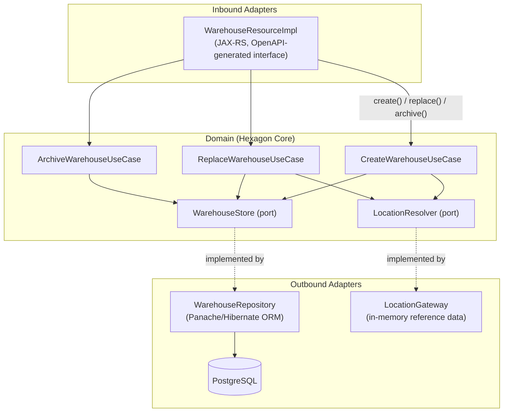
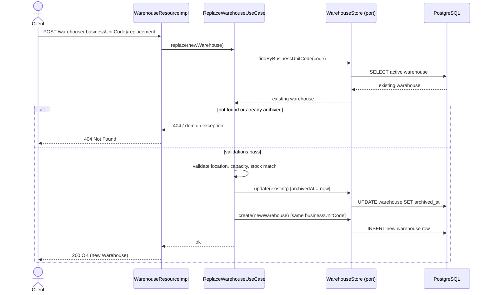
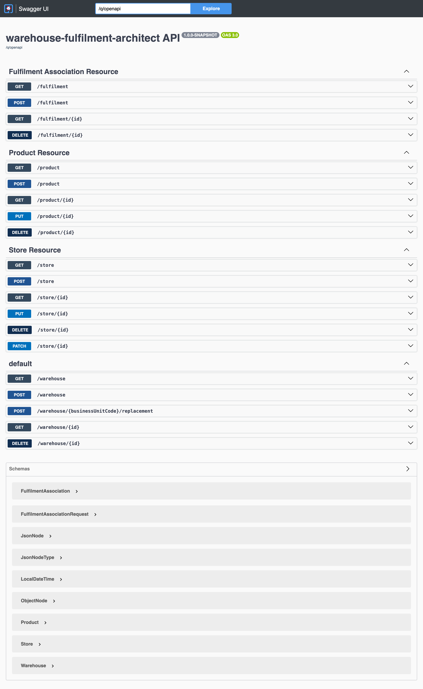
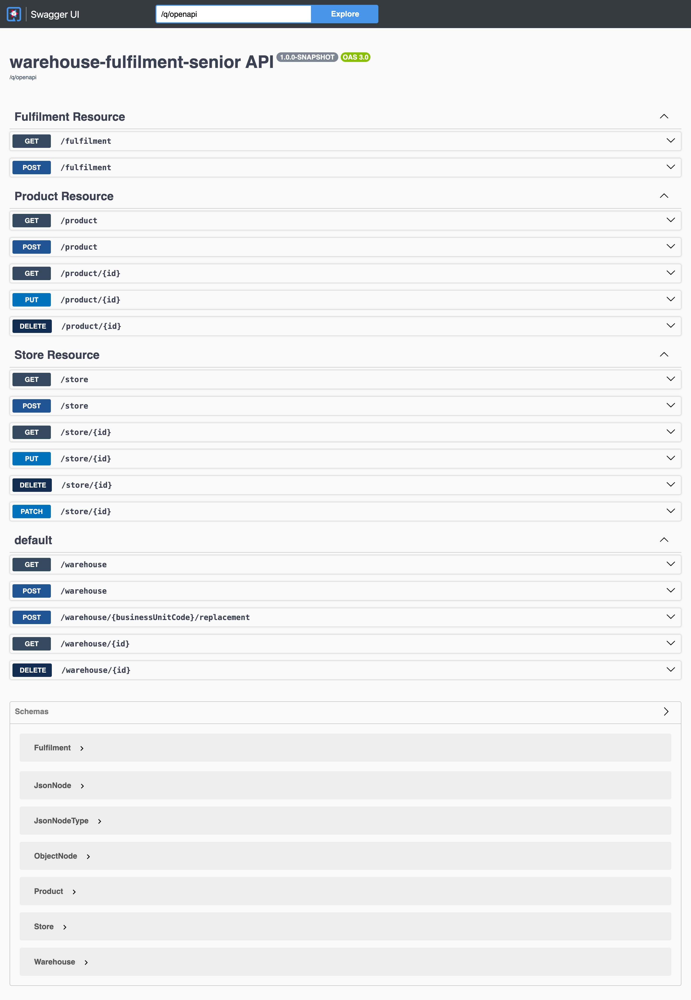
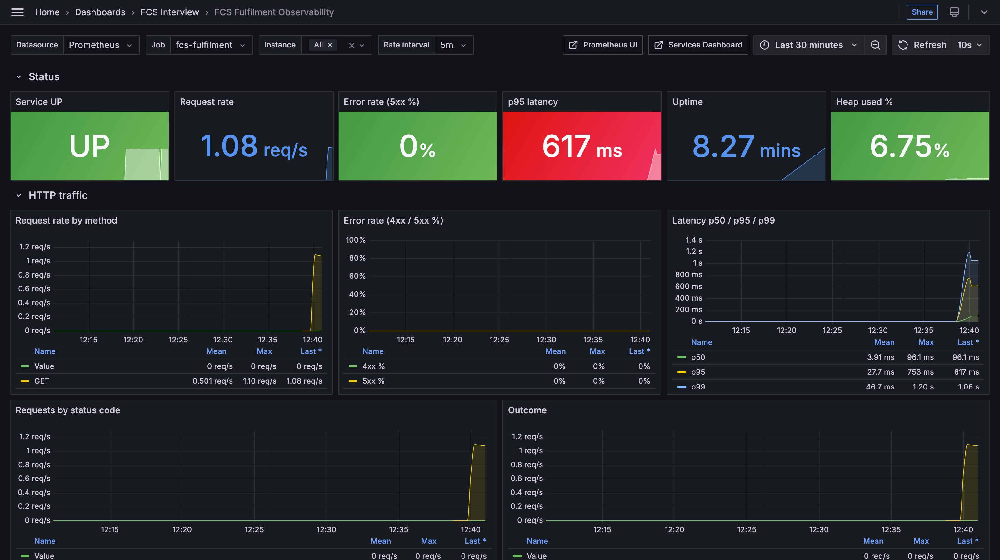
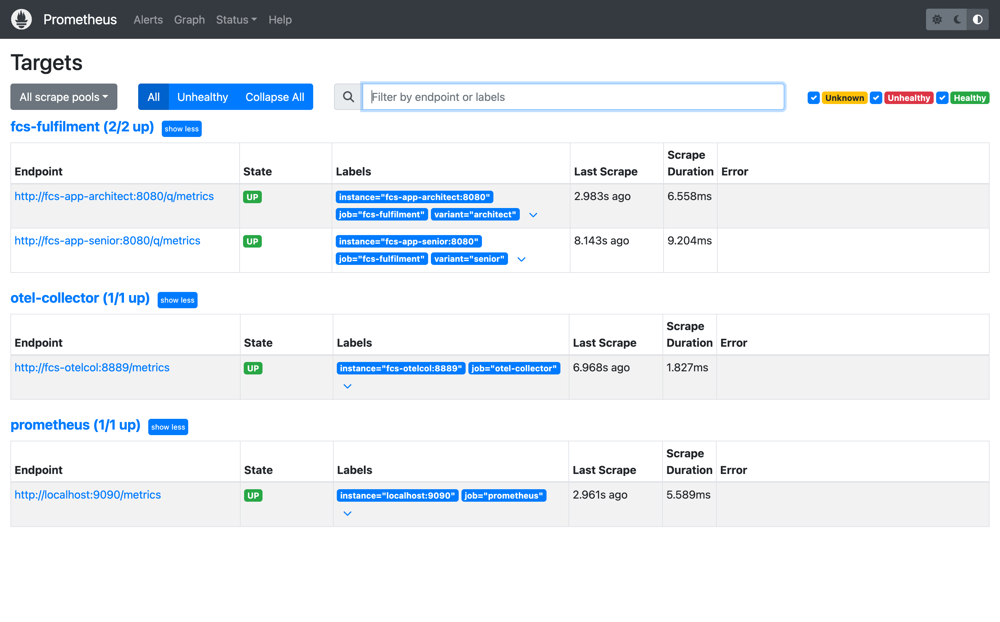

# FnCS Case Study — Warehouse Fulfilment Assignment


> Interview case study for a Quarkus/Java backend role. This repository contains the **original
> assignment** plus **two independent completions** of the same brief, written under different
> engineering philosophies, so both can be compared side by side.

## What this is

`fcs-interview-code-assignment-main` is a simplified **Warehouse colocation management system**.
The domain has four entities — `Location`, `Store`, `Warehouse`, `Product` — and the assignment
asks a candidate to implement the missing REST endpoints and business rules around creating,
retrieving, replacing, and archiving warehouses, plus a bonus fulfilment-association feature.

## Why it exists

The same brief was implemented twice to compare **two valid but different engineering answers**
to one problem:

- **`java-assignment-architect`** — a DDD/hexagonal-purist take: explicit domain exceptions, a
  dedicated `ExceptionMapper`, CDI events for cross-cutting side effects.
- **`java-assignment-senior`** — a pragmatic senior-dev take: minimum viable class count, direct
  `WebApplicationException` usage, no extra abstraction layers.

`java-assignment` is the **original, untouched** assignment handed to candidates (its endpoint
stubs still throw `UnsupportedOperationException`) and is kept as the baseline/reference.

> **Note on repository state**: as of this writing, both `java-assignment-architect` and
> `java-assignment-senior` have no remaining `UnsupportedOperationException` stubs and both
> `QUESTIONS.md` files are fully answered. This document reflects that on-disk state; re-check
> before relying on it if the modules are edited again afterwards.

## Table of Contents

- [What this is](#what-this-is)
- [Why it exists](#why-it-exists)
- [Architecture](#architecture)
- [Features](#features)
- [Architect vs. Senior](#architect-vs-senior)
- [Installation / Setup](#installation--setup)
- [Usage](#usage)
- [Screenshots](#screenshots)
- [Project Structure](#project-structure)

## Architecture

Both completed modules follow a **ports-and-adapters (hexagonal)** shape for the `Warehouse`
subdomain: a REST adapter receives HTTP requests, delegates to a use case in the domain layer,
and the use case talks to persistence and to other bounded contexts (`Location`, `Store`,
`Product`) only through ports (interfaces).



The **replace** operation is the one special workflow in the domain: it archives the existing
warehouse for a Business Unit Code and creates a new warehouse re-using that same code, so cost
and operational history stays traceable across the swap.



## Features

| Capability | `java-assignment` (original) | `java-assignment-architect` | `java-assignment-senior` |
|---|---|---|---|
| `Location.resolveByIdentifier` | ❌ stub (`UnsupportedOperationException`) | ✅ implemented | ✅ implemented |
| Store legacy sync after commit | ❌ stub | ✅ CDI event, fired post-commit | ✅ `TransactionSynchronizationRegistry` callback, post-commit |
| Warehouse create/get/list | ❌ stub | ✅ implemented | ✅ implemented |
| Warehouse archive | ❌ stub | ✅ implemented, domain exceptions | ✅ implemented, `WebApplicationException` |
| Warehouse replace (archive + re-create) | ❌ stub | ✅ implemented, validated | ✅ implemented, validated |
| Business Unit Code / location / capacity / stock validation | ❌ stub | ✅ `WarehouseValidator` | ✅ inline in use case |
| Bonus: fulfilment association (Warehouse↔Product↔Store) | ❌ not present | ✅ `FulfilmentAssociationResource` (full CRUD + domain rules) | ✅ `FulfilmentResource` (create + list, inline rules) |
| `QUESTIONS.md` answered | — (candidate template) | ✅ answered | ✅ answered |

## Architect vs. Senior

Both modules solve the **exact same brief** — same entities, same endpoints, same business
rules — but choose different trade-offs:

| Aspect | `java-assignment-architect` | `java-assignment-senior` |
|---|---|---|
| Error handling | Custom domain exception hierarchy (`WarehouseDomainException` and subclasses) + a dedicated `WarehouseExceptionMapper` (`@Provider`) that translates domain errors to HTTP | Direct `WebApplicationException(message, status)` thrown from the use case / resource, no domain exception hierarchy |
| Cross-cutting side effects (legacy store sync) | CDI event (`StoreLegacySyncEvent`) fired from `StoreResource`, observed by `StoreLegacySyncObserver` | Runnable registered via `TransactionSynchronizationRegistry.registerInterposedSynchronization`, run directly in `StoreResource` |
| Validation | Extracted into a dedicated `WarehouseValidator` collaborator, injected into use cases | Inlined directly inside each use case method |
| Bonus fulfilment feature | Full hexagonal slice: `FulfilmentAssociation` domain model, `CreateFulfilmentAssociationOperation` port, `FulfilmentAssociationStore` port, dedicated resolvers for `Product`/`Store`, its own exception types | Single Panache entity (`Fulfilment`) plus one `@ApplicationScoped` REST resource with the 3 fulfilment constraints checked inline |
| File/class count for the same scope | Higher — one class per responsibility (port, use case, exception, mapper) | Lower — logic co-located, fewer files to navigate |
| Best fit when... | The domain is expected to grow, multiple teams touch it, or strict separation of HTTP/domain concerns is a hard requirement | Time-to-ship and a small, stable scope matter more than long-term extensibility |

Both are functionally equivalent from the API consumer's point of view — the OpenAPI-generated
`WarehouseResource` interface is implemented in both.

## Installation / Setup

### Requirements

- JDK 17+ (`JAVA_HOME` pointing at a JDK 17 install)
- Maven (or the bundled `./mvnw` wrapper)
- A container runtime for the PostgreSQL Dev Service used by tests (Docker or Podman)

### Build & test

The two completed variants are aggregated by a
[parent `pom.xml`](fcs-interview-code-assignment-main/pom.xml)
(`com.inventorix:java-code-assignment-parent`), so a single reactor build validates both:

```sh
JAVA_HOME=/path/to/jdk-17 mvn -s fcs-interview-code-assignment-main/settings-central.xml \
  -f fcs-interview-code-assignment-main/pom.xml clean test
```

Each module also builds standalone (`java-assignment`, the untouched original, stays out of the
reactor on purpose). Using `mvn -f <pom.xml>` works from the repository root:

```sh
JAVA_HOME=/path/to/jdk-17 mvn -s fcs-interview-code-assignment-main/settings-central.xml \
  -f fcs-interview-code-assignment-main/java-assignment-architect/pom.xml test
```

```sh
JAVA_HOME=/path/to/jdk-17 mvn -s fcs-interview-code-assignment-main/settings-central.xml \
  -f fcs-interview-code-assignment-main/java-assignment-senior/pom.xml test
```

If your container runtime is Podman instead of Docker, point Quarkus Dev Services (Testcontainers)
at the Podman socket before running tests:

```sh
export DOCKER_HOST=unix://$(podman machine inspect --format '{{.ConnectionInfo.PodmanSocket.Path}}')
```

`quarkus.datasource` is only configured for the `%prod` profile in `application.properties` — dev
and test modes rely on Quarkus Dev Services to boot a disposable PostgreSQL container
automatically, so no manual database setup is needed for `mvn test`.

### Run a module in dev mode

`./mvnw` resolves its wrapper config (`.mvn/`) relative to the current working directory, so `cd`
into the module first — running it from the repository root fails with
`ClassNotFoundException: MavenWrapperMain`:

```sh
cd fcs-interview-code-assignment-main/java-assignment-architect
./mvnw quarkus:dev
```

Live coding is enabled — code and entity changes are picked up on refresh, and Dev Services keeps
a PostgreSQL container running for you.

### Run against a manually-started PostgreSQL (prod mode)

With Podman (primary on this machine — no Docker daemon installed):

```sh
podman run -it --rm --name quarkus_test -e POSTGRES_USER=quarkus_test \
  -e POSTGRES_PASSWORD=quarkus_test -e POSTGRES_DB=quarkus_test -p 15432:5432 postgres:13.3
```

With Docker, if available:

```sh
docker run -it --rm=true --name quarkus_test -e POSTGRES_USER=quarkus_test \
  -e POSTGRES_PASSWORD=quarkus_test -e POSTGRES_DB=quarkus_test -p 15432:5432 postgres:13.3
```

Then, from inside the module directory:

```sh
cd fcs-interview-code-assignment-main/java-assignment-architect
./mvnw package
java -jar ./target/quarkus-app/quarkus-run.jar
```

## Usage

`Warehouse` endpoints are generated from `src/main/resources/openapi/warehouse-openapi.yaml`
(`quarkus-openapi-generator-server`, base package `com.warehouse.api`) and implemented by
`WarehouseResourceImpl`. `Product` and `Store` are hand-coded JAX-RS resources with no OpenAPI
contract.

| Method | Path | Description | Module(s) |
|---|---|---|---|
| `GET` | `/warehouse` | List all active warehouse units | architect, senior |
| `POST` | `/warehouse` | Create a new warehouse unit | architect, senior |
| `GET` | `/warehouse/{id}` | Get a warehouse unit by ID | architect, senior |
| `DELETE` | `/warehouse/{id}` | Archive a warehouse unit by ID | architect, senior |
| `POST` | `/warehouse/{businessUnitCode}/replacement` | Archive the active warehouse for `businessUnitCode` and create its replacement | architect, senior |
| `GET` | `/store`, `/store/{id}` | List / get stores | architect, senior |
| `POST` | `/store` | Create a store (legacy sync fires after commit) | architect, senior |
| `PUT`, `PATCH` | `/store/{id}` | Update a store | architect, senior |
| `DELETE` | `/store/{id}` | Delete a store | architect, senior |
| `GET`, `POST`, `PUT`, `DELETE` | `/product`, `/product/{id}` | Standard product CRUD | architect, senior |
| `GET`, `POST` | `/fulfilment` | Bonus: list / create Warehouse↔Product↔Store associations | senior |
| `GET`, `POST`, `DELETE` | `/fulfilment`, `/fulfilment/{id}` | Bonus: list / create / remove associations | architect |

> Business Unit Codes follow the `MWH.xxx` pattern seeded in `import.sql` (e.g. `MWH.001`,
> `MWH.012`, `MWH.023`) — they identify the warehouse, not the location. `location` is a
> separate field referencing a `Location` identifier (e.g. `AMSTERDAM-001`).

### Example — create a warehouse

```
POST /warehouse
Content-Type: application/json

{
  "businessUnitCode": "MWH.099",
  "location": "AMSTERDAM-001",
  "capacity": 80,
  "stock": 30
}
```

```
201 Created
{
  "id": "4",
  "businessUnitCode": "MWH.099",
  "location": "AMSTERDAM-001",
  "capacity": 80,
  "stock": 30
}
```

### Example — replace a warehouse

`MWH.012` is seeded in `import.sql` at location `AMSTERDAM-001` with `capacity=50`, `stock=5`.
Replacing it means the new warehouse must keep `stock=5` exactly and offer `capacity >= 5`:

```
POST /warehouse/MWH.012/replacement
Content-Type: application/json

{
  "businessUnitCode": "MWH.012",
  "location": "AMSTERDAM-001",
  "capacity": 100,
  "stock": 5
}
```

The previous warehouse for `MWH.012` is archived (`archivedAt` set) and a new active warehouse
row is created with the same Business Unit Code — the new warehouse's `capacity` must be able to
hold the previous warehouse's `stock`, and `stock` must match exactly (both modules enforce
this).

### Example — bonus fulfilment association (senior module)

```
POST /fulfilment
Content-Type: application/json

{
  "warehouseId": 1,
  "productId": 1,
  "storeId": 1
}
```

Rejected with `400`/`409` if it would violate any of: max 2 warehouses per product per store, max
3 warehouses per store, max 5 products per warehouse, or the association already exists.

## Screenshots

All captures below come from a live run of the full stack (`./fcs-interview-code-assignment-main/allen-key.sh` — both apps, PostgreSQL, OTel Collector, Prometheus and Grafana on random free ports).

### Swagger UI — architect variant (`/q/swagger-ui`)



### Swagger UI — senior variant (`/q/swagger-ui`)



### Grafana — FCS Fulfilment Observability dashboard

Live HTTP traffic (request rate, error rate, p95 latency, heap) scraped from both variants:



### Prometheus — scrape targets (all UP)



## Project Structure

```
FnCS_Casestudy2/                         # repo root
├── README.md                            # this file (case-study index, English)
├── README-br.md                         # Brazilian Portuguese counterpart
└── fcs-interview-code-assignment-main/
    ├── pom.xml                          # parent aggregator: java-code-assignment-parent (architect + senior)
    ├── README.md                        # upstream Quarkus quickstart README (per-module build/run notes)
    ├── case-study/
    │   ├── BRIEFING.md                  # Domain overview: Location, Store, Warehouse, Product
    │   └── CASE_STUDY.md                # Discussion scenarios (cost tracking, budgeting, etc.)
    ├── java-assignment/                 # Original candidate assignment (untouched, stubs intact)
    │   ├── CODE_ASSIGNMENT.md
    │   ├── QUESTIONS.md
    │   └── src/main/java/com/fulfilment/application/monolith/
    │       ├── location/                # LocationGateway (stub)
    │       ├── products/                # Product CRUD
    │       ├── stores/                  # Store CRUD + LegacyStoreManagerGateway
    │       └── warehouses/              # Warehouse domain (stub use cases)
    ├── java-assignment-architect/       # DDD/hexagonal-purist implementation
    │   ├── README.md                    # variant-specific docs (philosophy, decisions, build)
    │   └── src/main/java/com/fulfilment/application/monolith/
    │       ├── fulfilment/
    │       │   ├── adapters/{database,restapi}/
    │       │   └── domain/{exceptions,models,ports,usecases,validation}/
    │       ├── location/
    │       ├── products/
    │       ├── stores/
    │       └── warehouses/
    │           ├── adapters/{database,restapi}/
    │           └── domain/{exceptions,models,ports,usecases,validation}/
    └── java-assignment-senior/          # Pragmatic senior-dev implementation
        ├── README.md                    # variant-specific docs (philosophy, decisions, build)
        └── src/main/java/com/fulfilment/application/monolith/
            ├── fulfilment/              # Fulfilment.java (Panache entity) + FulfilmentResource
            ├── location/
            ├── products/
            ├── stores/
            └── warehouses/
                ├── adapters/{database,restapi}/
                └── domain/{models,ports,usecases}/
```

---

Crafted in Lisbon 🇵🇹 by [tfantas](https://www.tfantas.io) — July 2026
